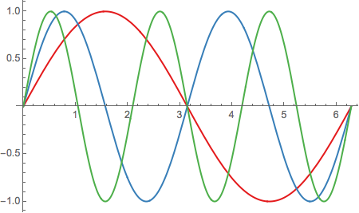
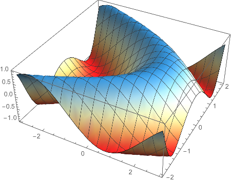
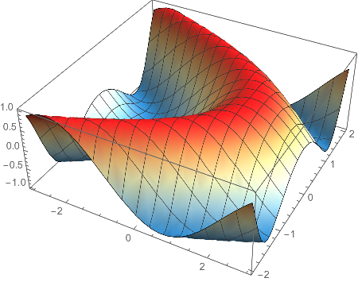
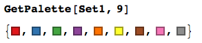
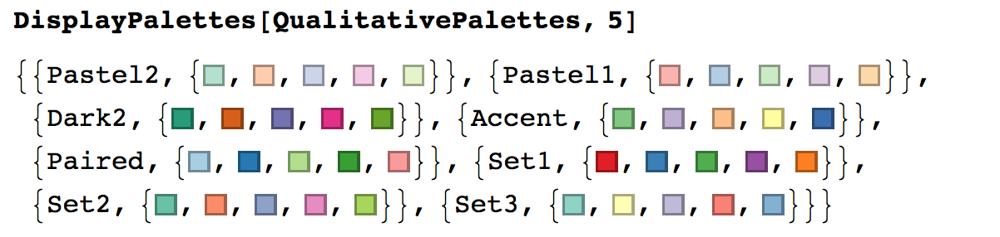

# ColorBrewer
make use of color palette from http://colorbrewer2.org in *Mathematica*

This is my first package written in *Mathematica*. This package provide a simple wrapper for [ColorBrewer](http://colorbrewer2.org).

## Usage

	<<ColorBrewer`
	GetPalette[PaletteName,ColorNumber] 
	(*Get the palette with ColorNumber colors under palette with name PaletteName *)
	CreateColorFunction[PaletteName,ColorNumber]
	(*Get a ColorFunction with ColorNumber colors by palette named PaletteName *)

## Example

	Plot[Evaluate@Table[Sin[i x], {i, 1, 4}], {x, 0, 2 Pi}, 
	 PlotStyle -> GetPalette[Set1, 4]]

	Plot3D[Sin[x + y^2], {x, -3, 3}, {y, -2, 2}, 
	 ColorFunction -> 
	  Function[{x, y, z}, CreateColorFunction[RdYlBu, 5][z]]]

Reverse the `ColorFunction` with the third argument in `CreateColorFunction`.

	Plot3D[Sin[x + y^2], {x, -3, 3}, {y, -2, 2}, 
	 ColorFunction -> 
	  Function[{x, y, z}, CreateColorFunction[RdYlBu, 5, True][z]]]

You may also use `GetPalette` to check the color palette first, such as [Assigning the third argument to `True` to get a reversed palette.] 

You may also display a list of palettes, such as following predefined ones with `DisplayPalettes`

	SequentialPalettes ={"Reds", "YlOrRd", "RdPu", "OrRd", "PuBu", "Greens", "GnBu", 
		"BuPu", "Greys", "Oranges", "YlGnBu", "BuGn", "YlOrBr", "PuRd", "Blues", "PuBuGn", 
		"YlGn", "Purples"}
	DivergingPalettes ={"Spectral", "RdYlGn", "PRGn", "RdBu", "RdGy", "RdYlBu", "PiYG", "PuOr", "BrBG"}
	QualitativePalettes = {"Pastel2", "Pastel1", "Dark2", "Accent", "Paired", "Set1", "Set2", "Set3"}

## Feedback

Open an issue in the tracker.

